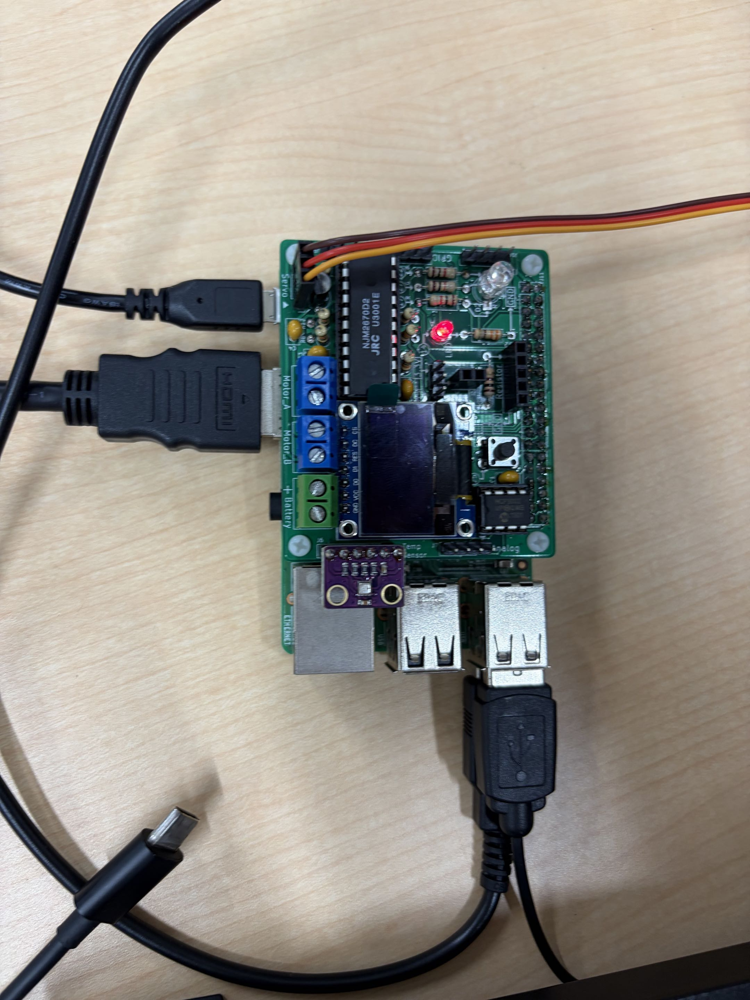

# Raspberry Pi サンプル集

Raspberry Pi の GPIO / センサー / UDP通信の学習用サンプルコード集です。

## 動作環境

- Raspberry Pi (GPIOを使うため実機での実行が必要)
- Python 3

## セットアップ (requirements.txt)

`requirements.txt` には pip パッケージ名ではなく、実行すべきコマンドがそのまま書かれています。

```
sudo apt install python3-gpiozero
sudo apt install python3-lgpio
sudo apt install python3-smbus
sudo raspi-config nonint do_i2c 0
pip install bme280 --break-system-packages
```

`1-led` (gpiozero) と `3-moter` (lgpio) で使うライブラリと，ME280気温・湿度・気圧センサーを使う `2-sensor` と `4-udp/42-sensor` で必要になるライブラリです。
以下のいずれかの方法でセットアップしてください。

```bash
# 1行ずつ実行する場合
sudo apt install python3-gpiozero
sudo apt install python3-lgpio
sudo apt install python3-smbus
sudo raspi-config nonint do_i2c 0
pip install bme280 --break-system-packages

# まとめて実行する場合
bash requirements.txt
```

サーボモーターは次のように接続してください．


## 1-led — LEDの点灯時間計測

[1-led/led_activation_log.py](1-led/led_activation_log.py)

- RGB LED (R=GPIO17, G=GPIO27, B=GPIO22) とボタン (GPIO25) を使用
- 15秒間、ボタンを押すたびにLEDのON/OFFを切り替え、切り替え回数と合計点灯時間を計測して表示する

```bash
python3 1-led/led_activation_log.py
```

## 2-sensor — BME280センサーの値取得

[2-sensor/sensor.py](2-sensor/sensor.py)

- I2C接続のBME280センサー(I2Cチャンネル1、アドレス0x76)から気温・湿度・気圧を1回読み取って表示する
- 事前に `requirements.txt` のセットアップが必要

```bash
python3 2-sensor/sensor.py
```

## 3-moter — サーボモーター制御

[3-moter/servo_motor.py](3-moter/servo_motor.py)

- GPIO24に接続したサーボモーターを、1秒ごとに角度を60度ずつ(0〜180度の範囲で)動かし続ける
- 停止する場合は Ctrl+C

```bash
python3 3-moter/servo_motor.py
```

## 4-udp — UDP通信サンプル

サーバー・クライアントに分かれたUDP通信のサンプルです。先にサーバーを起動してからクライアントを実行してください。

### 41-text — 文字列のエコー送信

- [4-udp/41-text/udp_echo_server.py](4-udp/41-text/udp_echo_server.py): 指定ポートで待受け、受信したメッセージと送信元IPを表示し続ける
- [4-udp/41-text/udp_echo_client.py](4-udp/41-text/udp_echo_client.py): 指定した文字列をサーバーへ送信し続ける(0.001秒間隔の無限ループ、Ctrl+Cで停止)

```bash
# サーバー側
python3 4-udp/41-text/udp_echo_server.py <ポート番号>

# クライアント側
python3 4-udp/41-text/udp_echo_client.py <サーバーIP> <送信文字列> [ポート番号(省略時7)]
```

### 42-sensor — センサー値のUDP送信

- [4-udp/42-sensor/udp_echo_server.py](4-udp/42-sensor/udp_echo_server.py): 41-textのサーバーと同じ(受信内容を表示するだけ)
- [4-udp/42-sensor/udp_echo_client.py](4-udp/42-sensor/udp_echo_client.py): BME280センサーの値(気温・湿度・気圧)を文字列化してサーバーへ送信し続ける
- 事前に `requirements.txt` のセットアップが必要

```bash
# サーバー側
python3 4-udp/42-sensor/udp_echo_server.py <ポート番号>

# クライアント側(BME280センサーを接続したPiで実行)
python3 4-udp/42-sensor/udp_echo_client.py <サーバーIP> [ポート番号(省略時7)]
```
